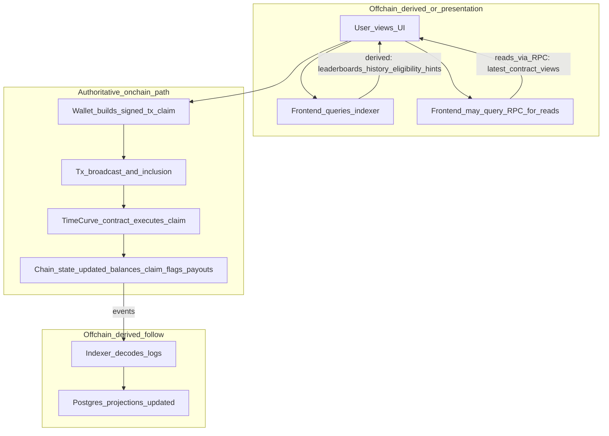
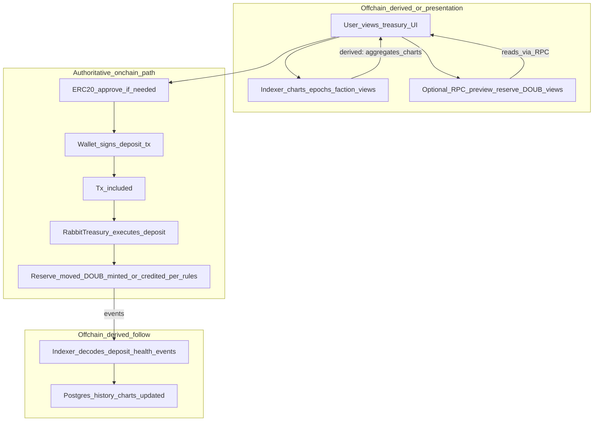

# User data flows (onchain vs offchain)

This document expands [architecture/overview.md](overview.md) with **step-by-step flows** for two common actions. **MegaEVM contracts** are authoritative for balances, eligibility, and outcomes; the **indexer** is a **derived** read model ([indexer/design.md](../indexer/design.md)). **RPC** reflects canonical chain state (subject to reorgs and provider correctness).

---

## TimeCurve: user claims a prize

The user may use the UI (often backed by the indexer) to decide *when* and *whether* to claim. **Value movement and final eligibility** are determined only when a **signed transaction** is executed by the **TimeCurve** contract. Podium categories and tie-breaking are **onchain** per [product/primitives.md](../product/primitives.md).

| Step | Authoritative onchain | Derived offchain |
|------|------------------------|------------------|
| User views TimeCurve UI | — | Presentation only (static site) |
| Indexer-backed leaderboards / “you may have a claim” | — | **Derived** (replay of logs + projections) |
| Optional RPC reads (e.g. claimable, sale ended) | **Yes** (contract state via RPC) | — |
| Signed `claim` transaction | **Yes** | — |
| Post-tx balances and claim consumed | **Yes** | — |
| Indexer updating prize / history rows | — | **Derived** (must match chain; reorg-handled per indexer design) |

---

## Rabbit Treasury: user deposits (Burrow)

The user may see charts, epoch context, or projected DOUB from the **indexer**. **Reserve transfer, DOUB mint/burn, and repricing rules** are enforced by the **RabbitTreasury** contract. Indexer tables (deposits, health epochs) are **projections** of onchain events/snapshots, not the ledger of truth ([product/rabbit-treasury.md](../product/rabbit-treasury.md)). **Canonical `Burrow*` log names** for reserve-health charts are in [Reserve health metrics and canonical events](../product/rabbit-treasury.md#reserve-health-metrics-and-canonical-events) in `rabbit-treasury.md`.

| Step | Authoritative onchain | Derived offchain |
|------|------------------------|------------------|
| UI / indexer charts (reserve health, epoch, factions) | — | **Derived** (from onchain events/snapshots per design) |
| RPC reads of allowance, limits, contract views | **Yes** | — |
| Token `approve` | **Yes** | — |
| `deposit` transaction execution | **Yes** | — |
| Final reserve and DOUB balances | **Yes** | — |
| Indexer deposit history and analytics | — | **Derived** |

---

## Failure modes when the indexer is wrong or stale

The indexer must **never** be authority for balances or winners ([overview](overview.md)); it **follows** chain history ([indexer/design.md](../indexer/design.md)). If projections lag or are incorrect:

**Shared**

- **Stale projections** — UI shows an old timer, epoch, or sale phase; user *expectations* diverge from chain until refresh or contract reads; **outcomes at tx time** follow **latest** chain state.
- **Wrong aggregates** — Leaderboards or totals differ from chain; **confusion**, bad UX, or **wrong agent decisions**; onchain calls still **revert or succeed** per **contracts**, not the indexer.
- **Reorg / indexing bugs** — Missing or duplicate rows; **history and analytics** wrong; dashboards/agents may **disagree with block explorers** until fixed.
- **Schema / API version drift** — Clients use stale schemas; **wrong fields** while chain remains correct.

**TimeCurve claim-specific**

- **Incorrect winner or category in indexer** — User **trusts** wrong info; may **skip** a valid claim or **attempt** an invalid one (**wasted gas** on revert).
- **Stale “sale still active”** — User delays claim or mis-times strategy; **onchain** end time remains source of truth.

**Rabbit Treasury deposit-specific**

- **Stale DOUB preview / health / epoch** — User **expected** a different conversion or phase; **actual** mint/repricing follows **contract** at execution.
- **Wrong faction or score in indexer-only views** — **Display or agent** errors; **onchain** rules for NFT/faction hooks (if any) still govern the transaction.

---

**Agent phase:** [Phase 3 — Architecture overview and trust boundaries](../agent-phases.md#phase-3)
