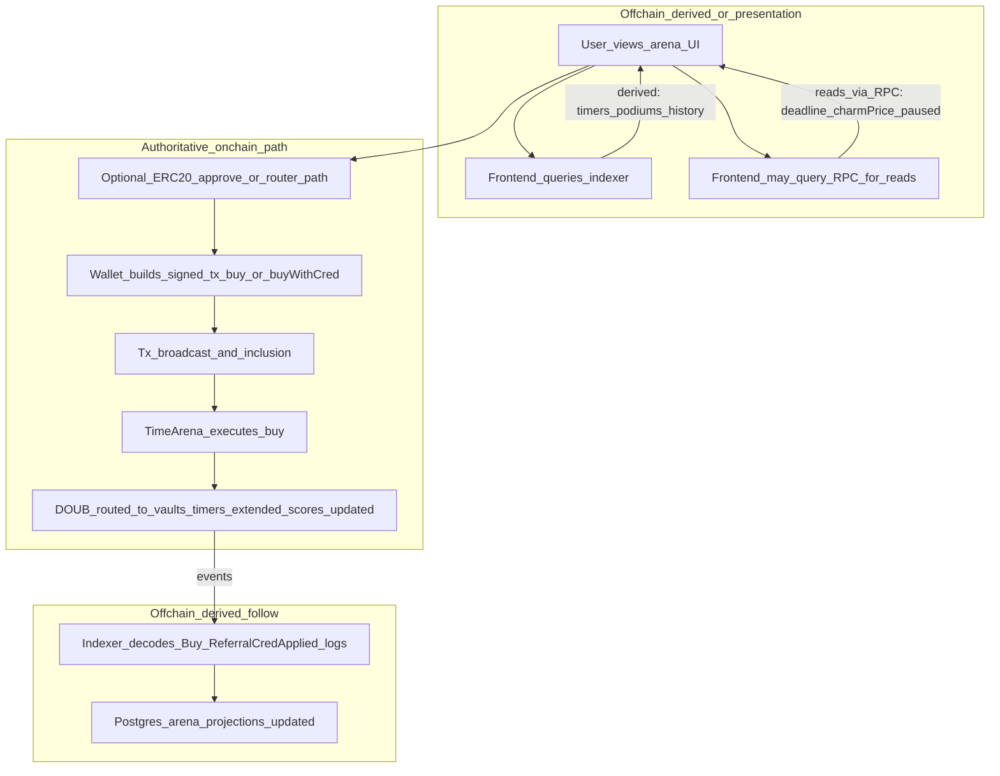
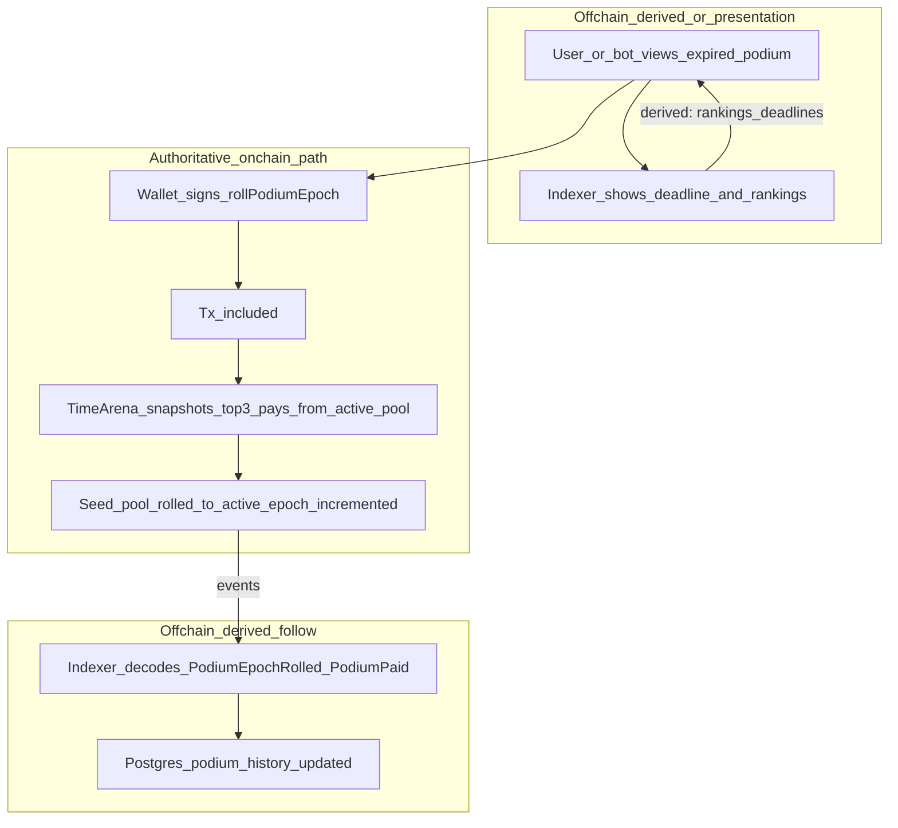
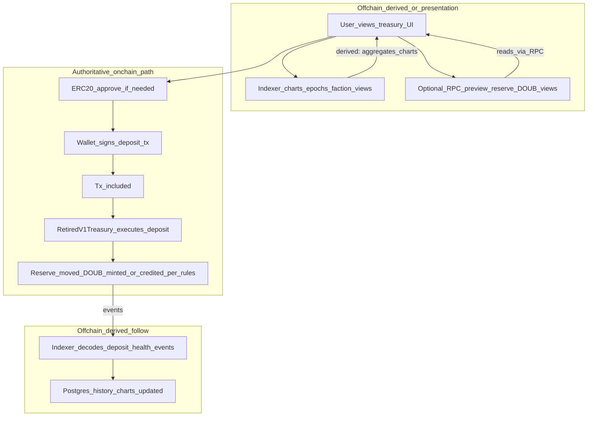

# User data flows (onchain vs offchain)

This document expands [architecture/overview.md](overview.md) with **step-by-step flows** for two common actions. **MegaEVM contracts** are authoritative for balances, eligibility, and outcomes; the **indexer** is a **derived** read model ([indexer/design.md](../indexer/design.md)). **RPC** reflects canonical chain state (subject to reorgs and provider correctness).

---

## TimeArena: user buys (DOUB or Play CRED)

The user may use the UI (often backed by the indexer) to decide *when* and *whether* to buy. **Value movement, timer extension, and podium scoring** are determined only when a **signed transaction** is executed by **`TimeArena`**. Podium categories and tie-breaking are **onchain** per [product/arena-v2.md](../product/arena-v2.md) and [product/time-arena.md](../product/time-arena.md).

| Step | Authoritative onchain | Derived offchain |
|------|------------------------|------------------|
| User views **`/arena`** UI | — | Presentation only (static site) |
| Indexer-backed timers, podiums, buy feed | — | **Derived** (replay of logs + projections) |
| Optional RPC reads (e.g. `deadline`, `charmPriceWad`, `paused`) | **Yes** (contract state via RPC) | — |
| Token `approve` or router **`buyViaKumbaya`** path | **Yes** | — |
| Signed **`buy`** / **`buyWithCred`** transaction | **Yes** | — |
| Post-tx vault balances, timer deadlines, scores | **Yes** | — |
| Indexer updating buy / timer / podium rows | — | **Derived** (must match chain; reorg-handled per indexer design) |

---

## TimeArena: podium epoch roll and prize payout

Anyone may call **`rollPodiumEpoch(category)`** after that category's deadline. **Prize snapshots, 4∶2∶1 payouts, and seed→active transfers** are enforced by **`TimeArena`** and **`PodiumVaults`**. WarBow (category 3) skips auto-payout — owner **`finalizeWarbowPodium`** settles that epoch ([#252](https://gitlab.com/PlasticDigits/yieldomega/-/issues/252)).

| Step | Authoritative onchain | Derived offchain |
|------|------------------------|------------------|
| UI / indexer podium rankings and deadlines | — | **Derived** |
| RPC reads of `podiumDeadline`, `podiumEpoch`, live scores | **Yes** | — |
| **`rollPodiumEpoch(category)`** after expiry | **Yes** | — |
| Final DOUB payouts and vault balances | **Yes** | — |
| Indexer podium history and winner rows | — | **Derived** |

---

## retired v1 player reserve: user deposits (v1 reserve)

The user may see charts, epoch context, or projected DOUB from the **indexer**. **Reserve transfer, DOUB mint/burn, and repricing rules** are enforced by the **RetiredV1Treasury** contract. Indexer tables (deposits, health epochs) are **projections** of onchain events/snapshots, not the ledger of truth ([product/retired-v1-reserve.md](../product/retired-v1-reserve.md)). **Canonical `RetiredV1*` log names** for reserve-health charts are in [Reserve health metrics and canonical events](../product/retired-v1-reserve.md#reserve-health-metrics-and-canonical-events) in `retired-v1-reserve.md`.

| Step | Authoritative onchain | Derived offchain |
|------|------------------------|------------------|
| UI / indexer charts (reserve health, epoch, factions) | — | **Derived** (from onchain events/snapshots per design) |
| RPC reads of allowance, limits, contract views | **Yes** | — |
| Token `approve` | **Yes** | — |
| `deposit` transaction execution | **Yes** | — |
| Final reserve and DOUB balances | **Yes** | — |
| Indexer deposit history and analytics | — | **Derived** |

---

## Failure modes when the indexer is wrong or stale

The indexer must **never** be authority for balances or winners ([overview](overview.md)); it **follows** chain history ([indexer/design.md](../indexer/design.md)). If projections lag or are incorrect:

**Shared**

- **Stale projections** — UI shows an old timer, epoch, or sale phase; user *expectations* diverge from chain until refresh or contract reads; **outcomes at tx time** follow **latest** chain state.
- **Wrong aggregates** — Leaderboards or totals differ from chain; **confusion**, bad UX, or **wrong agent decisions**; onchain calls still **revert or succeed** per **contracts**, not the indexer.
- **Reorg / indexing bugs** — Missing or duplicate rows; **history and analytics** wrong; dashboards/agents may **disagree with block explorers** until fixed.
- **Schema / API version drift** — Clients use stale schemas; **wrong fields** while chain remains correct.

**TimeArena buy-specific**

- **Incorrect podium ranking in indexer** — User **trusts** wrong info; may **mis-time** buys or WarBow actions (**wasted gas** on revert or suboptimal play).
- **Stale timer display** — User delays a buy; **onchain** `deadline` / `podiumDeadline[cat]` remain source of truth.
- **Head poller ahead of ingest ([#344](https://gitlab.com/PlasticDigits/yieldomega/-/issues/344))** — **`GET /v1/arena/timers`** and **`GET /v1/arena/podiums`** expose **`read_block_number`** (RPC head snapshot) and **`indexed_through_block`** (`chain_pointer`). When **`indexed_through_block` < `read_block_number`**, deadline/epoch fields from the head poller may show a new epoch before **`PodiumEpochRolled`**, live podium rows, or activity reflect it. Clients should not treat head-only fields as “final” until ingest catches up; compare the two block fields for a sync indicator. Map: **`INV-INDEXER-344-INGEST-LAG`** · [design — arena timers](../indexer/design.md#arena-timers-http-gitlab-216).

**TimeArena roll-specific**

- **Stale “podium not yet expired”** — User or bot delays **`rollPodiumEpoch`**; **onchain** deadline governs eligibility.

**retired v1 player reserve deposit-specific**

- **Stale DOUB preview / health / epoch** — User **expected** a different conversion or phase; **actual** mint/repricing follows **contract** at execution.
- **Wrong faction or score in indexer-only views** — **Display or agent** errors; **onchain** rules for NFT/faction hooks (if any) still govern the transaction.

---

**Agent phase:** [Phase 3 — Architecture overview and trust boundaries](../agent-phases.md#phase-3)
