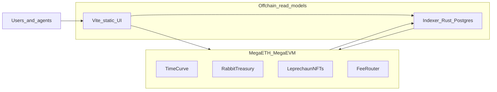

# Architecture overview

## Purpose

This document defines **system context**, **trust boundaries**, and **data flows** for a monorepo that will contain:

- **Smart contracts** (`contracts/`) — Foundry project targeting MegaEVM; all **authoritative** game and treasury logic.
- **Indexer** (`indexer/`) — Rust service plus Postgres; **derived** state for queries, analytics, and agents.
- **Frontend** (`frontend/`) — Vite-built **static** site; wallet interactions and reads from indexer and/or RPC.

No package implements privileged game rules offchain.

## Trust boundaries

| Layer | Trust model |
|--------|-------------|
| MegaEVM contracts | Source of truth for balances, sales, timers, winners (per contract rules), NFT traits stored onchain, fee splits enforced by code. |
| Full nodes / RPC | Provides canonical chain state; subject to reorgs and provider correctness. |
| Indexer | Replays chain data into a database; must handle reorgs; must never **invent** outcomes not derivable from chain + contract ABI. |
| Static frontend | User-facing; can err on presentation but should not hold secrets that control funds. |

## RPC versus indexer

- **Direct RPC** — Good for wallet calls, single-contract reads, and “latest block” interactions. High rate limits or heavy aggregation can be costly or slow for browsers.
- **Indexer** — Good for leaderboards, history, time series, faction aggregates, and agent batch queries. Must stay **eventually consistent** with chain and define **lag** and **reorg** behavior explicitly (see [indexer/design.md](../indexer/design.md)).

## Fully onchain logic

“Fully onchain” means:

1. **Authorization** for moving user funds or minting claims happens in contracts.
2. **Outcome determination** (for example sale end, prize eligibility, treasury repricing epochs) is defined in contract code or verifiable onchain state—not in a private server.
3. Offchain systems may **simulate** or **display** outcomes but must treat chain state as final.

## Upgrade and proxy strategy (design topic)

The codebase does not yet choose a pattern. Documented options to decide before mainnet:

- **Immutable contracts** — Maximum credible neutrality; upgrades require new deployments and migration UX.
- **Proxy + governed admin** — Flexible; requires transparent governance (CL8Y) and timelocks where appropriate.
- **Modular routers** — Split fee routing and game modules behind stable interfaces to limit upgrade blast radius.

Any chosen pattern should be reflected in [onchain/security-and-threat-model.md](../onchain/security-and-threat-model.md) and deployment runbooks.

## High-level diagram

## Relationship to product primitives

- **TimeCurve** and **Rabbit Treasury** generate fees and participation; **TimeCurve** uses the canonical split in [fee sinks](../onchain/fee-routing-and-governance.md#fee-sinks) ([full doc](../onchain/fee-routing-and-governance.md)); other modules use **their own** documented routes.
- **Leprechaun NFTs** attach identity and bonuses; metadata must remain **machine-readable onchain** (see [product/leprechaun-nfts.md](../product/leprechaun-nfts.md)).

## User data flows

Step-by-step flows (mermaid diagrams, onchain vs offchain per step, indexer failure modes): [data-flows.md](data-flows.md).

---

**Agent phase:** [Phase 3 — Architecture overview and trust boundaries](agent-phases.md#phase-3)
