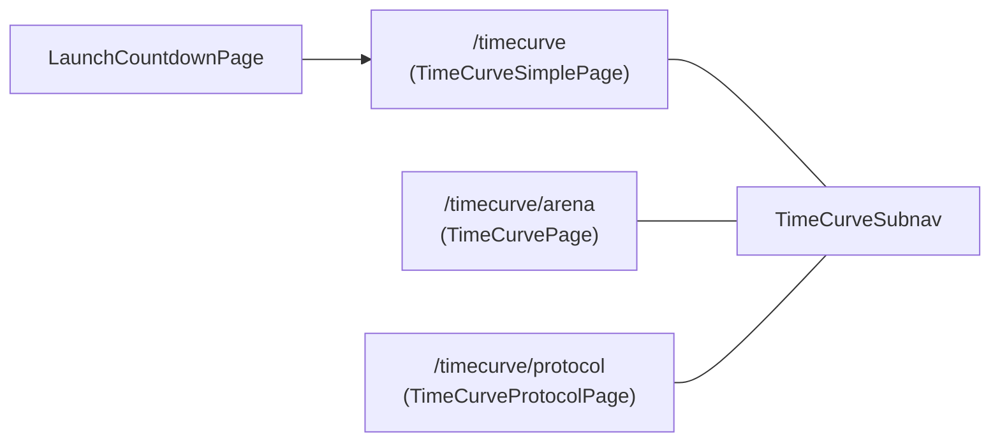

# TimeCurve frontend — three-view split (Simple · Arena · Protocol)

> **Status:** v1 (issue #40). Authoritative behaviors live onchain in
> [`contracts/src/TimeCurve.sol`](../../contracts/src/TimeCurve.sol); this doc
> describes only how the frontend exposes those behaviors via three routes
> sharing one sub-navigation.

## TL;DR

`/timecurve` (the public landing page) is split into three routes that share a
single sub-nav (`<TimeCurveSubnav />`):

| Route                  | Component                | Audience               | Reads from      | Writes from |
|------------------------|--------------------------|------------------------|-----------------|-------------|
| `/timecurve`           | `TimeCurveSimplePage`    | New users / first run  | `useTimeCurveSaleSession` (RPC) + `fetchTimecurveBuys` (indexer, latest 3) | `useTimeCurveSaleSession.buy()` |
| `/timecurve/arena`     | `TimeCurvePage` (existing) | Power users / PvP    | Existing `wagmi` reads + indexer (battle feed, podiums, WarBow)             | Existing `TimeCurvePage` write paths (buy, claim, WarBow steal/guard/revenge/flag) |
| `/timecurve/protocol`  | `TimeCurveProtocolPage`  | Operators / auditors   | `useReadContracts` against TimeCurve, `LinearCharmPrice`, `FeeRouter`       | _none_ (read-only) |

Every other primitive (timer reset rule, four reserve podiums, fee routing,
WarBow rules, redemption maths) is unchanged: the contract is the source of
truth, the frontend just changes how the surface is composed.

## Why three views

Issue #40 (cl8y-ecosystem-qa) flagged that the old `/timecurve` opened
straight into the dense PvP / podium / battle feed surface, which made it
hard for a first-time visitor to answer the only two questions they actually
have at launch:

1. **How much time is left?**
2. **How do I spend CL8Y to get CHARM weight?**

The split keeps the existing dense view (now `Arena`) for power users while
moving the first-run path to a calmer focal column on `/timecurve`.



## Single source of truth invariants

These invariants are guarded by code and tests; **do not** add a parallel
implementation in `TimeCurveSimplePage` or `TimeCurveProtocolPage`.

1. **Game logic stays onchain.** Min/max buy bounds, charm price, sale phase,
   redemption ratio, WarBow rules, and prize splits are read from the
   contracts (`TimeCurve`, `LinearCharmPrice`, `FeeRouter`). The frontend
   never recomputes a contract rule from cached indexer rows.
2. **One buy path.** `useTimeCurveSaleSession.buy(charmWad)` and
   `TimeCurvePage`'s buy handler ultimately call **the same** `TimeCurve.buy`
   write through `useWriteContract`. Approval handling, allowance checks, and
   referral plumbing live in one place per page surface but route to the
   same contract entrypoint with the same argument shape.
3. **`chainId` matches build target before wallet writes.** When connected and **`useChainId()`** ≠ [`configuredTargetChainId()`](../../frontend/src/lib/chain.ts) (`VITE_CHAIN_ID` / `VITE_RPC_URL`; default **Anvil** **31337**), Simple + Arena gated panels show **`ChainMismatchWriteBarrier`** and submit paths **`chainMismatchWriteMessage`** gates — [**Wrong network write gating (#95)**](#wrong-network-write-gating-issue-95); [wallet-connection.md § #95](wallet-connection.md#wrong-network-write-gating-issue-95).
4. **One phase machine + one clock for phase and hero timer.** Sale phase
   derivation (`saleStartPending`, `saleActive`, `saleExpiredAwaitingEnd`,
   `saleEnded`) lives in
   [`timeCurveSimplePhase.ts`](../../frontend/src/pages/timecurve/timeCurveSimplePhase.ts)
   as a pure function. `TimeCurveSimplePage` and `useTimeCurveSaleSession` route
   through `derivePhase()` for badge, narrative, and buy gating. The Arena view
   (`TimeCurvePage`) maps the same phase to its legacy booleans with
   `phaseFlags()`. The **“chain now”** fed into `derivePhase()` (and the
   simple-view pre-start window) is **`ledgerSecIntForPhase()`**: it **prefers**
   `useTimecurveHeroTimer`’s `chainNowSec` (indexer `/v1/timecurve/chain-timer`,
   wall–chain skew) when that snapshot exists, and **falls back** to
   `latestBlock` / wall time otherwise, so the phase strip cannot call the sale
   “pre-start” while the hero countdown is clearly in the live round — see
   [Chain time and sale phase (issue #48)](#chain-time-and-sale-phase-issue-48)
   and [issue #48](https://gitlab.com/PlasticDigits/yieldomega/-/issues/48).
5. **No new tokens, no new fee paths.** The Protocol view only displays
   what the contracts already expose. It never decodes JSON sink blobs or
   re-derives fee splits — it shows raw `bps` / addresses straight from
   `FeeRouter` and the routed top-level sinks. Human formatting uses
   `formatBpsAsPercent` / `formatCompactFromRaw` per
   [`design.md`](./design.md).

<a id="wrong-network-write-gating-issue-95"></a>

## Wrong network write gating (issue #95)

**Implementation:** **`ChainMismatchWriteBarrier`** overlays (Option C); primary CTAs additionally respect **`useWalletTargetChainMismatch()`** (Option A); **`chainMismatchWriteMessage`** rejects **`writeContract`** paths before assembling calldata. **`SwitchToTargetChainButton`** issues **`wallet_switchEthereumChain`** for [`configuredChain()`](../../frontend/src/lib/chain.ts).

**Targets:** `/timecurve` buy panel · `/timecurve/arena` buy hub, standings/post-end **`runVoid`** surface, **`WarbowSection`** · `/referrals` register · `/vesting` claim (not **`/protocol`**, **`/kumbaya`**, **`/sir`** navigational stubs).

Further reading: [`wallet-connection.md` — Wrong-network (#95)](wallet-connection.md#wrong-network-write-gating-issue-95), [`invariants` § #95](../testing/invariants-and-business-logic.md#frontend-wallet-chain-write-gating-issue-95), [play checklist](../../skills/verify-yo-chain-write-network/SKILL.md).

## Chain time and sale phase (issue #48)

**What must not happen:** the **hero deadline countdown** (and urgency styling
driven from it) shows a **live** round, while the **state badge** or **Buy CHARM
CTA** still read **pre-start** or **“Loading sale state…”** because two code
paths used two different ideas of “chain now.”

**Fix (merged with [issue #48](https://gitlab.com/PlasticDigits/yieldomega/-/issues/48)):** [`ledgerSecIntForPhase()`](../../frontend/src/pages/timecurve/timeCurveSimplePhase.ts) prefers
`useTimecurveHeroTimer`’s `chainNowSec` when the indexer has delivered
`/v1/timecurve/chain-timer`; `useTimeCurveSaleSession` and `TimeCurvePage` pass
the result into `derivePhase` and the simple-view pre-start window. On-chain
**authority** is unchanged: reads still use `TimeCurve.saleStart`, `deadline`,
`ended`, etc. This layer only picks a consistent **“now”** for comparing those
**timestamps** when the browser’s `latestBlock` can **lag** the same chain
the indexer (and bots) are using — common on local Anvil and multi-rail
setups.

**Spec ↔ test:** [invariants and business — TimeCurve frontend: sale phase and hero timer](../testing/invariants-and-business-logic.md#timecurve-frontend-sale-phase-and-hero-timer) ·
[`timeCurveSimplePhase.test.ts`](../../frontend/src/pages/timecurve/timeCurveSimplePhase.test.ts)
(`ledgerSecIntForPhase`, `derivePhase`).

<a id="indexer-offline-ux-issue-96"></a>

## Indexer offline signal, backoff, and Simple empty states (issue #96)

When **`VITE_INDEXER_URL`** points at an indexer that becomes unreachable mid-session, the UI must **not** look identical to “healthy indexer, zero rows” ([issue #96](https://gitlab.com/PlasticDigits/yieldomega/-/issues/96)).

**Reachability + backoff**

- **`reportIndexerFetchAttempt(ok)`** (in [`indexerConnectivity.ts`](../../frontend/src/lib/indexerConnectivity.ts)) aggregates outcomes from **`IndexerConnectivityProvider`** (`fetchIndexerStatus`), **`useTimecurveHeroTimer`** (`/v1/timecurve/chain-timer`), **`fetchTimecurveBuys`** on Simple and Arena, and any future poll that opts in. Failures increment the streak **at most once per wall-clock second** so parallel pollers do not triple-count the same outage.
- After **three** such seconds with failures, **`isOffline`** becomes true: **`IndexerStatusBar`** shows **Indexer offline · retrying** (error-styled pill). Poll intervals back off **30s → 60s → 120s** (per fast baseline: 1s hero refresh, 3s status, 5s Simple buys) until the next **`true`** report resets the streak.
- **`getJson`** / **`fetchTimecurveChainTimer`** swallow network errors and return **`null`** so pollers get a clean **`false`** outcome without unhandled rejections.

**`/timecurve` (Simple)** hides the global footer ([`RootLayout`](../../frontend/src/layout/RootLayout.tsx)); the same **`IndexerStatusBar`** is rendered above **Recent buys**. **Recent buys** empty copy: **Waiting for the first buy of this round** only when the last buys poll **succeeded** with zero rows **and** connectivity is not offline; otherwise prefer **Cannot reach indexer · cached data may be stale** (and a stale hint above the list when cached rows exist).

**Spec ↔ test:** [invariants — indexer offline UX](../testing/invariants-and-business-logic.md#indexer-offline-ux-and-backoff-gitlab-96) · [`indexerConnectivity.test.ts`](../../frontend/src/lib/indexerConnectivity.test.ts) · play checklist [`skills/verify-yo-indexer-offline-ux/SKILL.md`](../../skills/verify-yo-indexer-offline-ux/SKILL.md).

<a id="keyboard-focus-visible-issue-97"></a>

## Keyboard focus visible on TimeCurve (issue #97)

**`/timecurve`** was the reported repro for **invisible Tab focus** ([issue #97](https://gitlab.com/PlasticDigits/yieldomega/-/issues/97)): focus moved (`document.activeElement`) but **RainbowKit**’s **`[data-rk]`** reset applies **`outline: none`** with specificity that overrides unscoped **`button:focus-visible`**. **Fix:** global **`index.css`** mirrors the same **`:focus-visible`** selector list under **`[data-rk]`** and documents **`--yo-focus-ring`**.

**Spec ↔ test:** [invariants — keyboard focus visible](../testing/invariants-and-business-logic.md#keyboard-focus-visible-wcag-247-gitlab-97) · [wallet-connection.md](./wallet-connection.md) · [design — Accessibility](./design.md#accessibility-and-ux) · play checklist [`skills/verify-yo-focus-visible-a11y/SKILL.md`](../../skills/verify-yo-focus-visible-a11y/SKILL.md).

## WarBow pending flag UI (issues #51, #63)

**Onchain + logs:** **`Buy.flagPlanted`** is **`true` iff** that transaction **opted in** to planting the WarBow pending flag (`plantWarBowFlag` on **`buy`** / **`buyFor`** / **`buyViaKumbaya`** — [issue #63](https://gitlab.com/PlasticDigits/yieldomega/-/issues/63)). Indexer **`flag_planted`** mirrors the log. **Holder + silence** remain authoritative from **`warbowPendingFlagOwner`** / **`warbowPendingFlagPlantAt`** reads, not from “any recent buy row” ([issue #51](https://gitlab.com/PlasticDigits/yieldomega/-/issues/51)).

**Rules for the Arena / Simple UI:**

1. **Pending holder + silence** — Shown from **`warbowPendingFlagOwner`** / **`warbowPendingFlagPlantAt`** (wagmi), with seconds-until-silence-ends derived from the same **ledger “now”** as the hero timer / phase logic, **not** from the buy indexer.
2. **Per-buy highlights / feed tags** — **`flag_planted`** from indexer rows is now **meaningful per tx** (opt-in plant); still **do not** treat it as a substitute for live **`warbowPendingFlag*`** when showing **current** holder.
3. **Buy panels** — Expose an explicit **Plant WarBow flag** checkbox with **BP-loss risk** copy before confirmation; default **off** maps to **`buy(charmWad)`** only.
4. **Won vs destroyed** — **`WarBowFlagClaimed`** and **`WarBowFlagPenalized`** appear in the **rivalry feed** (`buildWarbowFeedNarrative`: **Flag won**, **Flag destroyed**).

**Spec ↔ test:** [invariants — WarBow flag plant opt-in](../testing/invariants-and-business-logic.md#timecurve-warbow-flag-plant-opt-in-issue-63) · [primitives — plant / claim flag](../product/primitives.md) · [`timeCurveUx.ts`](../../frontend/src/lib/timeCurveUx.ts) · [issue #51](https://gitlab.com/PlasticDigits/yieldomega/-/issues/51) · [issue #63](https://gitlab.com/PlasticDigits/yieldomega/-/issues/63).

<a id="arena-warbow-hero-actions-issue-101"></a>

## Arena WarBow hero actions (issue #101)

`/timecurve/arena` keeps the detailed [`WarbowSection`](../../frontend/src/pages/timecurve/TimeCurveSections.tsx)
below the fold, but the `PageHeroArcadeBanner` now exposes the live WarBow
decision surface directly through
[`WarbowHeroActions`](../../frontend/src/pages/timeCurveArena/WarbowHeroActions.tsx):

1. **Wallet context first:** the hero action area shows connect / connected
   state plus the viewer's live Battle Points before any PvP CTA.
2. **Steal without typing:** suggested steal targets come from the contract
   WarBow podium and indexed leaderboard, deduped by address and filtered
   client-side for the 2× BP rule when the viewer BP read is available. Selecting
   a row writes the same `stealVictimInput` used by the detailed section, so the
   existing live contract reads (`battlePoints`, `stealsReceivedOnDay`) and
   `describeStealPreflight` remain the final eligibility preview.
3. **Guard + revenge are obvious:** guard is a visible hero CTA with burn and
   active-until copy; revenge renders as a single action only when
   `warbowPendingRevengeStealer` / `warbowPendingRevengeExpiry` say the slot is
   open, including counterparty and deadline inline.
4. **Write barriers stay shared:** the hero WarBow cluster is inside the same
   `ChainMismatchWriteBarrier` pattern as the lower WarBow section, and the
   submit functions still preflight `chainMismatchWriteMessage` plus
   `buyFeeRoutingEnabled` before approval / writes.

Indexer rows are a discovery aid only. If candidate rows are stale, the selected
target still has to pass live onchain reads and wallet simulation. Empty
candidate state is explicit and points users to the detailed section's manual
address path.

**Spec ↔ test:** [invariants — Arena WarBow hero actions](../testing/invariants-and-business-logic.md#timecurve-arena-warbow-hero-actions-issue-101) · [product WarBow rules](../product/primitives.md#warbow-ladder-battle-points--pvp-and-reserve-slice) · [play skill](../../skills/play-timecurve-warbow/SKILL.md) · [issue #101](https://gitlab.com/PlasticDigits/yieldomega/-/issues/101).

<a id="arena-sniper-shark-cutout-issue-80"></a>

## Arena sniper-shark cutout (issue #80)

The sniper-shark pack is intentionally **not** a new global mascot. Arena uses a
single `sniper-shark-peek-scope.png` decoration on the **Buy CHARM** panel,
replacing the previous sneak-bunny cutout rather than adding another character
to the card. The rationale is narrow: the Arena buy card is where timing,
price pressure, and optional WarBow flag planting already create the "hunter /
sniper" mood. Simple, global chrome, and neutral operator surfaces stay shark
free.

**UI invariants**

1. **Sparse placement:** one shark asset on `/timecurve/arena`; no shark in the
   header, root layout, Simple first-run sale path, or Protocol read-only page.
2. **Decorative accessibility:** the placement uses `CutoutDecoration` with the
   default empty `alt`, so it is `aria-hidden` and does not add screen-reader
   noise.
3. **Motion restraint:** the cutout uses the existing `peek-loop` animation,
   which is suppressed by the global `prefers-reduced-motion` rule.
4. **Asset accounting:** runtime consumers are listed in
   [`frontend/public/art/README.md`](../../frontend/public/art/README.md), and
   the remaining shark variants stay staged until a surface has a specific
   narrative fit.

**Spec ↔ test:** [invariants — Arena sniper-shark cutout](../testing/invariants-and-business-logic.md#timecurve-arena-sniper-shark-cutout-issue-80) · [issue #80](https://gitlab.com/PlasticDigits/yieldomega/-/issues/80) · [visual QA skill](../../skills/verify-yo-sniper-shark-ui/SKILL.md).

<a id="buy-quote-refresh-kumbaya-issue-56"></a>

## Buy quote refresh (Kumbaya, issue #56)

When **Pay with** is **ETH** or **USDM**, [`useTimeCurveSaleSession`](../../frontend/src/pages/timecurve/useTimeCurveSaleSession.ts) reads the Kumbaya **`quoteExactOutput`** for the **current** CL8Y `amountOut` implied by the slider. TanStack Query v5 sets **`isFetching`** on **background refetches** even when **`isPending`** is false (cached row from the previous amount), so the hook treats **`isPending || isFetching`** while the quote query is enabled as **quote in flight**.

**UI invariants**

1. **Primary CTA** on [`TimeCurveSimplePage`](../../frontend/src/pages/TimeCurveSimplePage.tsx) shows **Refreshing quote…** and stays **disabled** until the quoter read settles for the current target — same window as `swapQuoteLoading` driving `nonCl8yBlocked`.
2. **`submitBuy`** still performs a fresh `readContract` quote immediately before building the swap tx; the CTA gate prevents rapid slider + click against a **visually** stale line item while RPC catches up (follow-up to the Anvil E2E race in [issue #52](https://gitlab.com/PlasticDigits/yieldomega/-/issues/52)).

**Spec ↔ test:** [invariants — Kumbaya quote refresh](../testing/invariants-and-business-logic.md#timecurve-simple-kumbaya-quote-refresh-issue-56) · [integrations/kumbaya.md](../integrations/kumbaya.md) · [issue #56](https://gitlab.com/PlasticDigits/yieldomega/-/issues/56).

<a id="buy-charm-submit-fresh-bounds-issue-82"></a>

## Buy CHARM — fresh bounds at submit (issue #82)

On a **live block clock**, `TimeCurve.currentCharmBoundsWad()` can **shift** (max **tightens**, min **rises**) between the moment the slider last rendered and the block where **`buy` / `buyViaKumbaya`** executes. The UI must not ship **stale `charmWad`** (or a CL8Y `amountOut` that no longer matches a valid `charmWad` at tx time).

**Invariants**

1. **Re-read before sign:** [`useTimeCurveSaleSession`](../../frontend/src/pages/timecurve/useTimeCurveSaleSession.ts) and [`useTimeCurveArenaModel`](../../frontend/src/pages/timeCurveArena/useTimeCurveArenaModel.tsx) call [`readFreshTimeCurveBuySizing`](../../frontend/src/lib/timeCurveBuySubmitSizing.ts) immediately before building swap / `buy` calldata — same path for **CL8Y**, **two-step Kumbaya + `buy`**, and **single-tx `buyViaKumbaya`**.
2. **Clamp below live max:** sizing uses an effective CHARM ceiling of **99.5%** of the freshly read `maxCharmWad` (`CHARM_SUBMIT_UPPER_SLACK_BPS = 50`) so drift toward a lower **max** is unlikely to revert the bound check.
3. **Floor above live min:** sizing uses an effective CHARM floor of **100.5%** of the freshly read `minCharmWad` (`CHARM_SUBMIT_LOWER_HEADROOM_BPS = 50`) so drift toward a higher **min** is less likely at the lower band edge ([issue #82](https://gitlab.com/PlasticDigits/yieldomega/-/issues/82)).
4. **CHARM from CL8Y is floored:** [`finalizeCharmSpendForBuy`](../../frontend/src/lib/timeCurveBuyAmount.ts) uses integer division for CHARM wei (never rounds **up** past the band).
5. **Bare revert copy:** buy submit catches pass `{ buySubmit: true }` into [`friendlyRevertFromUnknown`](../../frontend/src/lib/revertMessage.ts) so generic **“execution reverted for an unknown reason”** maps to guidance about the band moving ([issue #82](https://gitlab.com/PlasticDigits/yieldomega/-/issues/82)). Rare residual failures at the edge may succeed on **retry** after one block or a small slider nudge.

**Spec ↔ test:** [invariants — submit-time CHARM sizing](../testing/invariants-and-business-logic.md#timecurve-buy-charm-submit-fresh-bounds-issue-82) · [integrations/kumbaya.md — single-tx](../integrations/kumbaya.md#issue-65-single-tx-router) · [play checklist](../../skills/verify-yo-timecurve-buy-charm-submit/SKILL.md) · [issue #82](https://gitlab.com/PlasticDigits/yieldomega/-/issues/82).

<a id="kumbaya-swap-deadline-chain-time-issue-83"></a>

## Kumbaya swap deadline — chain time (issue #83)

For **ETH / USDM** entry, **`exactOutput`** and **`TimeCurveBuyRouter.buyViaKumbaya`** carry a **`swapDeadline`** that routers validate against **`block.timestamp`**. After **`anvil_increaseTime`** (e.g. **`anvil_rich_state.sh`**), chain time can be **minutes ahead** of the browser; deadlines must therefore use **`getBlock({ blockTag: 'latest' }).timestamp + buffer`** ([`fetchSwapDeadlineUnixSec`](../../frontend/src/lib/timeCurveKumbayaSwap.ts)), fetched **immediately before** the swap (two-step: after wrap/approve) or **`buyViaKumbaya`** write (single-tx: after any USDM approve). **Spec ↔ test:** [invariants — issue #83](../testing/invariants-and-business-logic.md#timecurve-kumbaya-swap-deadline-chain-time-issue-83) · [kumbaya.md — QA time warp](../integrations/kumbaya.md#qa-anvil-time-warp-and-swap-deadline-issue-83) · [issue #83](https://gitlab.com/PlasticDigits/yieldomega/-/issues/83).

<a id="timecurve-simple-audio-issue-68"></a>

## TimeCurve Simple — layered audio (issue #68)

The global **Web Audio** stack (BGM bus + SFX bus) unlocks on first user interaction; **TimeCurve Simple** wires **`coin_hit_shallow`** / **`charmed_confirm`** to the **`buy`** submit/receipt path, **`kumbaya_whoosh`** to **ETH / USDM / CL8Y** pay-mode changes, **indexer peer buys** + **timer heartbeats** via `useTimeCurveSimplePageSfx` (throttled; timer cues respect **`prefers-reduced-motion`**). **Album 1 BGM** persists **track + playback offset** across refresh ([issue #71](https://gitlab.com/PlasticDigits/yieldomega/-/issues/71)). Product mapping and accessibility notes: [sound-effects-recommendations.md §8](sound-effects-recommendations.md#8-in-app-implementation-album-1--sfx-bus-issue-68) · [invariants — frontend audio](../testing/invariants-and-business-logic.md#timecurve-frontend-album-1-bgm-and-sfx-bus-issue-68) · [issue #68](https://gitlab.com/PlasticDigits/yieldomega/-/issues/68).

## `TimeCurveSimplePage` layout contract

Page leads with **action**: the sale hub sits at the very top, the
`PageHero` (title + lede + chain-time deadline) follows below as a context
strip. This intentionally inverts the usual hero-on-top pattern so first-run
visitors see the timer + buy CTA before they read marketing copy. The hub
itself is a CSS-container-query grid (`container-type: inline-size`) — it
collapses to a single column when its rendered width drops below ~880 px,
which works inside narrow viewports, side panes, and embedded contexts where
viewport-keyed media queries would not fire. See `.timecurve-simple__hub`
in `frontend/src/index.css`.

Above-the-fold **sale hub** (two columns on wide containers, one column on
narrow):

1. **Timer panel** (left of the hub): hero countdown rendered through the
   shared
   [`TimeCurveTimerHero`](../../frontend/src/pages/timecurve/TimeCurveTimerHero.tsx)
   component, which mirrors the standalone
   [`LaunchCountdownPage`](../../frontend/src/pages/LaunchCountdownPage.tsx)
   design pattern so both timers read as siblings:
   - **Backplate scene art** (`/art/scenes/timecurve-simple.jpg`) at low
     opacity behind the digits, sitting on a deep green gradient with a
     bottom-glow stage.
   - **Animated rising sparks** that switch from yellow → red and slow → fast
     when the timer enters the `timer-hero--critical` urgency window
     (`timerUrgencyClass`, ≤ 5 minutes remaining). Animation is suppressed
     under `prefers-reduced-motion: reduce`.
   - **Days chip + tabular digits**: long durations split into a bordered
     gold `Nd` chip + `HH:MM:SS` clock via the shared `formatLaunchCountdown`
     helper (so 24h+ never renders as a confusing `48:13:07`); both digit
     tracks use `font-variant-numeric: tabular-nums` so per-second updates
     don't reflow the line.
   - **Urgency-aware glow + pulse** on the digits: gold text-shadow under
     `timer-hero--warning` (≤ 1h), red glow plus a subtle scale-pulse under
     `timer-hero--critical` (≤ 5m).
   The timer panel still uses `useTimecurveHeroTimer` for the underlying
   wall ↔ chain skew so Simple and Arena countdowns stay in lock-step. The
   panel header (driven by `PageSection`) carries the one-sentence
   narrative from `phaseNarrative()`, and a phase-aware foot line (e.g.
   "Every buy adds 2 minutes; clutch buys hard-reset the clock.") sits
   beneath the digits inside the hero.
2. **Buy panel** (right of the hub):
   - **Live rate board** at the top — the **single most-important number on
     the page** is "1 CHARM costs right now" rendered with fixed 6-decimal
     precision (`formatPriceFixed6` on `pricePerCharmWad`) so per-block ticks
     of ~1e-5 CL8Y are visibly obvious. Underneath, the at-launch chain
     "1 CHARM = N DOUB = M CL8Y" gives participants the full math: DOUB
     comes from `doubPerCharmAtLaunchWad(totalTokensForSale, totalCharmWeight)`
     and CL8Y from `participantLaunchValueCl8yWei` (the canonical 1.2×
     anchor). Both refresh via the hook's wagmi `refetchInterval: 1000` and
     `useBlock({ watch: true })` so they update on every new block / buy.
   - Inline min–max pill, slider + numeric input, two-line preview
     (**"You add ≈ X CHARM"** + **"Worth at launch ≈ Y CL8Y"**, hidden when
     the wallet holds no CHARM yet), single CTA labeled **Buy CHARM** (or
     **Refreshing quote…** when a Kumbaya quoter read is in flight for ETH/USDM
     pay mode — [Buy quote refresh](#buy-quote-refresh-kumbaya-issue-56)).
   - Pay-with (CL8Y/ETH/USDM), slippage, wallet balance, and referral
     controls live behind a collapsed `<details>` "Advanced" disclosure so
     first-run buyers see the rate board + slider + CTA + launch projection
     only. Cooldown / error state appear _below_ the CTA as compact
     secondary status.
   - When no wallet is connected, the panel renders a "Connect a wallet to
     buy CHARM…" prompt with the **shared** `<WalletConnectButton />`
     (`frontend/src/components/WalletConnectButton.tsx`) — same
     `wallet-action wallet-action--connect wallet-action--priority` style as
     the header so the connect CTA is visually consistent across the app.

Below the hub:

3. **`PageHero`** with `stateBadge` (`Pre-launch` / `Sale live` /
   `Sale ended`), the action-led lede ("Buy CHARM with CL8Y to lock in your
   share of the DOUB launch. Your CHARM only grows in CL8Y value as the sale
   heats up — the timer is the only thing in your way."), and chain-time
   deadline. The hero owns the sale-phase badge so the visual status
   indicator is shared with Arena / Protocol via `phaseBadge()`.
4. **"Your stake at launch" panel** (only when wallet connected and a sale is
   active or ended): two big-number tiles — your CHARM count and the
   projected **CL8Y at launch** computed from
   [`participantLaunchValueCl8yWei`](../../frontend/src/lib/timeCurvePodiumMath.ts)
   (the **launch-anchor invariant**: `1.2 × per-CHARM clearing price`,
   enforced by `DoubLPIncentives` and pinned by the
   [`launch-anchor invariant`](../testing/invariants-and-business-logic.md)
   test in `timeCurvePodiumMath.test.ts`). During the sale the **personal DOUB
   count for wallet holdings** stays **hidden** — DOUB-per-CHARM dilutes as
   `totalCharmWeight` grows, while CL8Y-at-launch only stays flat or rises.
   After **`redeemCharms`** (`charmsRedeemed` true), the panel adds **Redeemed
   DOUB**, **Settled** header chrome, and strikes through the CL8Y projection
   ([§ Stake-at-launch after redeemCharms](#timecurve-simple-stake-redeemed-issue-90)).
   (DOUB as a *rate* stays on the buy-panel rate board during the sale.) UX
   guarantee: if a participant only watches one number during the sale, CL8Y-at-launch is the right stress-free projection.
5. **Recent buys** — last 3 buys (wallet · amount · `+Xs` extension or
   `hard reset`) sourced from `fetchTimecurveBuys` (indexer). Falls back to
   a calm placeholder if the indexer is offline; never blocks the buy CTA.

Cross-page navigation to Arena / Protocol lives **only** in the persistent
`TimeCurveSubnav` at the top of every TimeCurve route — the simple view does
not duplicate those links inline. UX rationale: the subnav is already on
screen, an in-page tile row added vertical scroll for no new information.

The global app footer (`IndexerStatusBar` + `Canonical fee sinks` panel)
rendered by `RootLayout` is also **hidden on `/timecurve` only**. It stays
visible on Home, `/timecurve/arena`, `/timecurve/protocol`, and every other
route — the operator / power-user surfaces benefit from the indexer health
pill and the live fee-sink table, but on the Simple first-run path those
panels swamp the page with secondary information that distracts from the
single primary action. The `showFooter` toggle in
[`RootLayout.tsx`](../../frontend/src/layout/RootLayout.tsx) is keyed on
`location.pathname === "/timecurve"`.

<a id="global-footer-fee-sinks-mobile-issue-93"></a>

### Global footer — fee sinks on narrow viewports ([issue #93](https://gitlab.com/PlasticDigits/yieldomega/-/issues/93))

[`FeeTransparency`](../../frontend/src/components/FeeTransparency.tsx) renders live `FeeRouter` sink destinations plus optional indexer history. **Addresses** use [`MegaScannerAddressLink`](../../frontend/src/components/MegaScannerAddressLink.tsx): outbound URLs match [`explorerAddressUrl`](../../frontend/src/lib/explorer.ts) — **`{base}/address/{addr}`** with **`base`** from **`VITE_EXPLORER_BASE_URL`** (default **`https://mega.etherscan.io`**, same as **tx** links), **abbreviated** to **four** leading + **four** trailing glyphs at **≤479px** so rows do not clip in the footer panel. **`TimeCurveProtocolPage`** wired-contract and FeeRouter sink rows use the same component; KV `<dt>` labels use [`humanizeKvLabel`](../../frontend/src/lib/humanizeIdentifier.ts) so `WARBOW_*`, `camelCase`, and similar identifiers read as spaced words (**Play:** [`skills/verify-yo-fee-sinks-mobile/SKILL.md`](../../skills/verify-yo-fee-sinks-mobile/SKILL.md)). Participant identities elsewhere use [`AddressInline`](../../frontend/src/components/AddressInline.tsx) ([GitLab #98](https://gitlab.com/PlasticDigits/yieldomega/-/issues/98)).

Below-the-fold sections (WarBow ladder, podiums, full battle feed,
`RawDataAccordion`) are **deliberately omitted**. They live on `Arena` and
`Protocol` respectively. The simple page keeps its DOM small so it stays
fast on slow mobile connections.

<a id="timecurve-simple-stake-redeemed-issue-90"></a>

## Stake-at-launch after `redeemCharms` (issue #90)

When **`charmsRedeemed(wallet)`** is **true** ([issue #90](https://gitlab.com/PlasticDigits/yieldomega/-/issues/90)), the Simple panel [`TimeCurveStakeAtLaunchSection`](../../frontend/src/pages/timecurve/TimeCurveStakeAtLaunchSection.tsx):

1. Shows **Redeemed · X DOUB** using the same allocation ratio as **`redeemCharms`** (`expectedTokenFromCharms` in [`useTimeCurveSaleSession`](../../frontend/src/pages/timecurve/useTimeCurveSaleSession.ts)).
2. **Dims + strikes through** the **Worth at launch ≈** CL8Y figure (historical projection), with **(redeemed)** on the label — **option B rejected**: do **not** replace that CL8Y line with DOUB-only “worth” (misleading across CL8Y / ETH / USDM entry rails).
3. Adds **Settled** chrome (green check + badge) in the section header **`actions`** slot.

**Spec ↔ test:** [invariants — stake panel redeemed](../testing/invariants-and-business-logic.md#timecurve-simple-stake-redeemed-issue-90) · [`TimeCurveStakeAtLaunchSection.test.tsx`](../../frontend/src/pages/timecurve/TimeCurveStakeAtLaunchSection.test.tsx).

## `TimeCurveProtocolPage` layout

A read-only surface for operators:

- Sale state: phase, deadline, current charm price, total CHARM minted,
  total reserve raised, ended flag.
- Immutable parameters: launched token, accepted asset, min/max buy,
  podium / FeeRouter sinks (top-level `bps`).
- Linear charm price parameters (slope, intercept, resets).
- FeeRouter sinks for the accepted asset (LP / burn / podium / treasury / team).

All values come from `useReadContracts` (one batched RPC roundtrip per
contract) and are formatted with the existing `AmountDisplay` /
`UnixTimestampDisplay` / `formatBpsAsPercent` helpers. **KV `<dt>` labels**
use [`humanizeKvLabel`](../../frontend/src/lib/humanizeIdentifier.ts) for
Solidity-style identifiers (**`WARBOW_*`**, **`camelCase`** getters, etc.).
**Contract addresses** use [`MegaScannerAddressLink`](../../frontend/src/components/MegaScannerAddressLink.tsx) for the same **narrow-viewport** abbreviation + **explorer base URL** (`VITE_EXPLORER_BASE_URL`, default MegaETH Etherscan) as tx links and [`AddressInline`](../../frontend/src/components/AddressInline.tsx) ([§ Global footer — fee sinks](#global-footer-fee-sinks-mobile-issue-93), [GitLab #93](https://gitlab.com/PlasticDigits/yieldomega/-/issues/93), [GitLab #98](https://gitlab.com/PlasticDigits/yieldomega/-/issues/98)). There is no write
surface.

## Sub-navigation contract

`TimeCurveSubnav` is the **only** way to switch between the three views and
must be rendered at the top of each TimeCurve route with the matching
`active` prop. It uses `<NavLink>` from `react-router-dom`, so the active
state stays consistent with the URL even after a hard refresh or deep link.

```ts
<TimeCurveSubnav active="simple" | "arena" | "protocol" />
```

The sub-nav advertises one-line hints per tab so users know what they're
clicking into without having to navigate first.

## LaunchCountdown → Simple handoff

`LaunchGate.tsx` controls the pre-launch / post-launch routing. The contract
is:

- **Pre-launch (`now < VITE_LAUNCH_TIMESTAMP`):** every route renders
  `LaunchCountdownPage` (the marketing countdown). The TimeCurve sub-routes
  are still registered but gated.
- **At launch (`now >= VITE_LAUNCH_TIMESTAMP`):** the gate releases and the
  default `/` route lands on `TimeCurveSimplePage`. Direct links to
  `/timecurve/arena` or `/timecurve/protocol` continue to work; the simple
  view is just the friendly default.
- **No countdown configured (`VITE_LAUNCH_TIMESTAMP` unset / `0`):** the
  gate is a no-op and `/timecurve` immediately renders `TimeCurveSimplePage`.

For QA you can simulate the pre-launch state with the
`LAUNCH_OFFSET_SEC` knob in `scripts/start-local-anvil-stack.sh` (see the
QA checklist item C8). It writes `VITE_LAUNCH_TIMESTAMP=$now+offset` to
`frontend/.env.local`, so the next Vite restart hits the countdown and you
can watch it flip into the simple view live.

## Testing

- **Pure logic:**
  [`timeCurveSimplePhase.test.ts`](../../frontend/src/pages/timecurve/timeCurveSimplePhase.test.ts)
  covers `derivePhase`, `ledgerSecIntForPhase` (hero vs block clock — [issue #48](https://gitlab.com/PlasticDigits/yieldomega/-/issues/48)),
  `phaseBadge`, and `phaseNarrative` for all five
  phases (`loading` → `saleStartPending` → `saleActive` →
  `saleExpiredAwaitingEnd` → `saleEnded`).
- **Sub-nav:**
  [`TimeCurveSubnav.test.tsx`](../../frontend/src/pages/timecurve/TimeCurveSubnav.test.tsx)
  uses `renderToStaticMarkup` to assert the three tabs render in the right
  order with `aria-current="page"` on the active tab.
- **e2e:** `frontend/e2e/timecurve.spec.ts` asserts the simple view is the
  default `/timecurve` landing, hides the dense PvP sections above the fold,
  routes correctly through the sub-nav, and stays usable at a 390×844 mobile
  viewport. `frontend/e2e/launch-countdown.spec.ts` covers the pre-launch
  gate and its handoff.

Run order (after `bash scripts/start-local-anvil-stack.sh
SKIP_ANVIL_RICH_STATE=1 START_BOT_SWARM=1`):

```bash
cd frontend
npm run typecheck
npm run lint
npm test
npm run test:e2e -- --workers=5
```

## Files

- New: `frontend/src/pages/TimeCurveSimplePage.tsx`
- New: `frontend/src/pages/TimeCurveProtocolPage.tsx`
- New: `frontend/src/pages/timecurve/TimeCurveSubnav.tsx`
- New: `frontend/src/pages/timecurve/TimeCurveSubnav.test.tsx`
- New: `frontend/src/pages/timecurve/useTimeCurveSaleSession.ts`
- New: `frontend/src/pages/timecurve/timeCurveSimplePhase.ts`
- New: `frontend/src/pages/timecurve/timeCurveSimplePhase.test.ts`
- Edited: `frontend/src/pages/TimeCurvePage.tsx` (sub-nav + Arena framing only)
- Edited: `frontend/src/app/LaunchGate.tsx` (three routes + simple as default)
- Edited: `frontend/src/index.css` (`timecurve-simple-*`, `timecurve-subnav*` styles)
- Edited: `scripts/start-local-anvil-stack.sh` (`LAUNCH_OFFSET_SEC`)
- Edited: `frontend/.env.example` (`VITE_LAUNCH_TIMESTAMP` guidance)
- Edited: `frontend/e2e/timecurve.spec.ts`
- Edited: `frontend/vite.config.ts` (vitest now picks up `*.test.tsx`)

---

**Related:** [testing — invariants (TimeCurve frontend phase)](../testing/invariants-and-business-logic.md#timecurve-frontend-sale-phase-and-hero-timer) · [testing — WarBow pending flag / `Buy.flagPlanted`](../testing/invariants-and-business-logic.md#timecurve-frontend-warbow-pending-flag-and-buyflagplanted-issue-51) · [testing — WarBow flag plant opt-in (issue #63)](../testing/invariants-and-business-logic.md#timecurve-warbow-flag-plant-opt-in-issue-63) · [testing — Arena WarBow hero actions](../testing/invariants-and-business-logic.md#timecurve-arena-warbow-hero-actions-issue-101) · [testing — Arena sniper-shark cutout](../testing/invariants-and-business-logic.md#timecurve-arena-sniper-shark-cutout-issue-80) · [testing — Kumbaya quote refresh (Simple buy CTA)](../testing/invariants-and-business-logic.md#timecurve-simple-kumbaya-quote-refresh-issue-56) · [testing — Buy CHARM submit-time sizing (issue #82)](../testing/invariants-and-business-logic.md#timecurve-buy-charm-submit-fresh-bounds-issue-82) · [testing — Kumbaya swap deadline vs Anvil warp (issue #83)](../testing/invariants-and-business-logic.md#timecurve-kumbaya-swap-deadline-chain-time-issue-83) · [testing — Album 1 BGM + SFX bus](../testing/invariants-and-business-logic.md#timecurve-frontend-album-1-bgm-and-sfx-bus-issue-68) · [YO-TimeCurve-QA-Checklist](../qa/YO-TimeCurve-QA-Checklist.md) (C1, C12) · [issue #48](https://gitlab.com/PlasticDigits/yieldomega/-/issues/48) · [issue #51](https://gitlab.com/PlasticDigits/yieldomega/-/issues/51) · [issue #56](https://gitlab.com/PlasticDigits/yieldomega/-/issues/56) · [issue #63](https://gitlab.com/PlasticDigits/yieldomega/-/issues/63) · [issue #68](https://gitlab.com/PlasticDigits/yieldomega/-/issues/68) · [issue #80](https://gitlab.com/PlasticDigits/yieldomega/-/issues/80) · [issue #82](https://gitlab.com/PlasticDigits/yieldomega/-/issues/82) · [issue #83](https://gitlab.com/PlasticDigits/yieldomega/-/issues/83) · [issue #101](https://gitlab.com/PlasticDigits/yieldomega/-/issues/101)

**Agent phase:** [Phase 13 — Frontend design (Vite static)](../agent-phases.md#phase-13)
