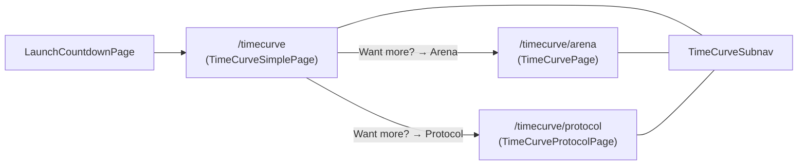

# TimeCurve frontend — three-view split (Simple · Arena · Protocol)

> **Status:** v1 (issue #40). Authoritative behaviors live onchain in
> [`contracts/src/TimeCurve.sol`](../../contracts/src/TimeCurve.sol); this doc
> describes only how the frontend exposes those behaviors via three routes
> sharing one sub-navigation.

## TL;DR

`/timecurve` (the public landing page) is split into three routes that share a
single sub-nav (`<TimeCurveSubnav />`):

| Route                  | Component                | Audience               | Reads from      | Writes from |
|------------------------|--------------------------|------------------------|-----------------|-------------|
| `/timecurve`           | `TimeCurveSimplePage`    | New users / first run  | `useTimeCurveSaleSession` (RPC) + `fetchTimecurveBuys` (indexer, latest 3) | `useTimeCurveSaleSession.buy()` |
| `/timecurve/arena`     | `TimeCurvePage` (existing) | Power users / PvP    | Existing `wagmi` reads + indexer (battle feed, podiums, WarBow)             | Existing `TimeCurvePage` write paths (buy, claim, WarBow steal/guard/revenge/flag) |
| `/timecurve/protocol`  | `TimeCurveProtocolPage`  | Operators / auditors   | `useReadContracts` against TimeCurve, `LinearCharmPrice`, `FeeRouter`       | _none_ (read-only) |

Every other primitive (timer reset rule, four reserve podiums, fee routing,
WarBow rules, redemption maths) is unchanged: the contract is the source of
truth, the frontend just changes how the surface is composed.

## Why three views

Issue #40 (cl8y-ecosystem-qa) flagged that the old `/timecurve` opened
straight into the dense PvP / podium / battle feed surface, which made it
hard for a first-time visitor to answer the only two questions they actually
have at launch:

1. **How much time is left?**
2. **How do I spend CL8Y to get CHARM weight?**

The split keeps the existing dense view (now `Arena`) for power users while
moving the first-run path to a calmer focal column on `/timecurve`.



## Single source of truth invariants

These invariants are guarded by code and tests; **do not** add a parallel
implementation in `TimeCurveSimplePage` or `TimeCurveProtocolPage`.

1. **Game logic stays onchain.** Min/max buy bounds, charm price, sale phase,
   redemption ratio, WarBow rules, and prize splits are read from the
   contracts (`TimeCurve`, `LinearCharmPrice`, `FeeRouter`). The frontend
   never recomputes a contract rule from cached indexer rows.
2. **One buy path.** `useTimeCurveSaleSession.buy(charmWad)` and
   `TimeCurvePage`'s buy handler ultimately call **the same** `TimeCurve.buy`
   write through `useWriteContract`. Approval handling, allowance checks, and
   referral plumbing live in one place per page surface but route to the
   same contract entrypoint with the same argument shape.
3. **One phase machine + one clock for phase and hero timer.** Sale phase
   derivation (`saleStartPending`, `saleActive`, `saleExpiredAwaitingEnd`,
   `saleEnded`) lives in
   [`timeCurveSimplePhase.ts`](../../frontend/src/pages/timecurve/timeCurveSimplePhase.ts)
   as a pure function. `TimeCurveSimplePage` and `useTimeCurveSaleSession` route
   through `derivePhase()` for badge, narrative, and buy gating. The Arena view
   (`TimeCurvePage`) maps the same phase to its legacy booleans with
   `phaseFlags()`. The **“chain now”** fed into `derivePhase()` (and the
   simple-view pre-start window) is **`ledgerSecIntForPhase()`**: it **prefers**
   `useTimecurveHeroTimer`’s `chainNowSec` (indexer `/v1/timecurve/chain-timer`,
   wall–chain skew) when that snapshot exists, and **falls back** to
   `latestBlock` / wall time otherwise, so the phase strip cannot call the sale
   “pre-start” while the hero countdown is clearly in the live round — see
   [Chain time and sale phase (issue #48)](#chain-time-and-sale-phase-issue-48)
   and [issue #48](https://gitlab.com/PlasticDigits/yieldomega/-/issues/48).
4. **No new tokens, no new fee paths.** The Protocol view only displays
   what the contracts already expose. It never decodes JSON sink blobs or
   re-derives fee splits — it shows raw `bps` / addresses straight from
   `FeeRouter` and the routed top-level sinks. Human formatting uses
   `formatBpsAsPercent` / `formatCompactFromRaw` per
   [`design.md`](./design.md).

## Chain time and sale phase (issue #48)

**What must not happen:** the **hero deadline countdown** (and urgency styling
driven from it) shows a **live** round, while the **state badge** or **Buy CHARM
CTA** still read **pre-start** or **“Loading sale state…”** because two code
paths used two different ideas of “chain now.”

**Fix (merged with [issue #48](https://gitlab.com/PlasticDigits/yieldomega/-/issues/48)):** [`ledgerSecIntForPhase()`](../../frontend/src/pages/timecurve/timeCurveSimplePhase.ts) prefers
`useTimecurveHeroTimer`’s `chainNowSec` when the indexer has delivered
`/v1/timecurve/chain-timer`; `useTimeCurveSaleSession` and `TimeCurvePage` pass
the result into `derivePhase` and the simple-view pre-start window. On-chain
**authority** is unchanged: reads still use `TimeCurve.saleStart`, `deadline`,
`ended`, etc. This layer only picks a consistent **“now”** for comparing those
**timestamps** when the browser’s `latestBlock` can **lag** the same chain
the indexer (and bots) are using — common on local Anvil and multi-rail
setups.

**Spec ↔ test:** [invariants and business — TimeCurve frontend: sale phase and hero timer](../testing/invariants-and-business-logic.md#timecurve-frontend-sale-phase-and-hero-timer) ·
[`timeCurveSimplePhase.test.ts`](../../frontend/src/pages/timecurve/timeCurveSimplePhase.test.ts)
(`ledgerSecIntForPhase`, `derivePhase`).

## `TimeCurveSimplePage` layout contract

Above-the-fold focal column (top → bottom):

1. **`PageHero`** with `stateBadge` (`Pre-launch` / `Live` / `Ended`) and a
   single short lede: "Spend CL8Y → get CHARM. CHARM redeems for DOUB after
   the timer dies."
2. **Hero countdown** (reuses `useTimecurveHeroTimer` so wall ↔ chain skew
   matches the Arena view) plus a one-sentence narrative driven by
   `phaseNarrative()`.
3. **Buy card** (primary CTA): wallet balance pill, inline min–max range,
   slider + numeric input, prominent **"You will get ≈ X CHARM"** preview,
   single CTA labeled **Buy CHARM** (sub-text: "Approves CL8Y if needed,
   then submits the buy"). Cooldown / disconnect / referral state appear
   _below_ the CTA as compact secondary status, not as blockers.
4. **Activity ticker** — last 3 buys (wallet · amount · `+Xs` extension or
   `hard reset`) sourced from `fetchTimecurveBuys` (indexer). Falls back to
   a calm placeholder if the indexer is offline; never blocks the buy CTA.
5. **"Want more?" tiles** linking to `/timecurve/arena` and
   `/timecurve/protocol`, each with a small live stat hint (e.g. WarBow leader
   BP, deadline unix) so the secondary surfaces are discoverable without
   recreating their content.

Below-the-fold sections (WarBow ladder, podiums, full battle feed,
`RawDataAccordion`) are **deliberately omitted**. They live on `Arena` and
`Protocol` respectively. The simple page keeps its DOM small so it stays
fast on slow mobile connections.

## `TimeCurveProtocolPage` layout

A read-only surface for operators:

- Sale state: phase, deadline, current charm price, total CHARM minted,
  total reserve raised, ended flag.
- Immutable parameters: launched token, accepted asset, min/max buy,
  podium / FeeRouter sinks (top-level `bps`).
- Linear charm price parameters (slope, intercept, resets).
- FeeRouter sinks for the accepted asset (LP / burn / podium / treasury / team).

All values come from `useReadContracts` (one batched RPC roundtrip per
contract) and are formatted with the existing `AmountDisplay` /
`UnixTimestampDisplay` / `formatBpsAsPercent` helpers. There is no write
surface.

## Sub-navigation contract

`TimeCurveSubnav` is the **only** way to switch between the three views and
must be rendered at the top of each TimeCurve route with the matching
`active` prop. It uses `<NavLink>` from `react-router-dom`, so the active
state stays consistent with the URL even after a hard refresh or deep link.

```ts
<TimeCurveSubnav active="simple" | "arena" | "protocol" />
```

The sub-nav advertises one-line hints per tab so users know what they're
clicking into without having to navigate first.

## LaunchCountdown → Simple handoff

`LaunchGate.tsx` controls the pre-launch / post-launch routing. The contract
is:

- **Pre-launch (`now < VITE_LAUNCH_TIMESTAMP`):** every route renders
  `LaunchCountdownPage` (the marketing countdown). The TimeCurve sub-routes
  are still registered but gated.
- **At launch (`now >= VITE_LAUNCH_TIMESTAMP`):** the gate releases and the
  default `/` route lands on `TimeCurveSimplePage`. Direct links to
  `/timecurve/arena` or `/timecurve/protocol` continue to work; the simple
  view is just the friendly default.
- **No countdown configured (`VITE_LAUNCH_TIMESTAMP` unset / `0`):** the
  gate is a no-op and `/timecurve` immediately renders `TimeCurveSimplePage`.

For QA you can simulate the pre-launch state with the
`LAUNCH_OFFSET_SEC` knob in `scripts/start-local-anvil-stack.sh` (see the
QA checklist item C8). It writes `VITE_LAUNCH_TIMESTAMP=$now+offset` to
`frontend/.env.local`, so the next Vite restart hits the countdown and you
can watch it flip into the simple view live.

## Testing

- **Pure logic:**
  [`timeCurveSimplePhase.test.ts`](../../frontend/src/pages/timecurve/timeCurveSimplePhase.test.ts)
  covers `derivePhase`, `ledgerSecIntForPhase` (hero vs block clock — [issue #48](https://gitlab.com/PlasticDigits/yieldomega/-/issues/48)),
  `phaseBadge`, and `phaseNarrative` for all five
  phases (`loading` → `saleStartPending` → `saleActive` →
  `saleExpiredAwaitingEnd` → `saleEnded`).
- **Sub-nav:**
  [`TimeCurveSubnav.test.tsx`](../../frontend/src/pages/timecurve/TimeCurveSubnav.test.tsx)
  uses `renderToStaticMarkup` to assert the three tabs render in the right
  order with `aria-current="page"` on the active tab.
- **e2e:** `frontend/e2e/timecurve.spec.ts` asserts the simple view is the
  default `/timecurve` landing, hides the dense PvP sections above the fold,
  routes correctly through the sub-nav, and stays usable at a 390×844 mobile
  viewport. `frontend/e2e/launch-countdown.spec.ts` covers the pre-launch
  gate and its handoff.

Run order (after `bash scripts/start-local-anvil-stack.sh
SKIP_ANVIL_RICH_STATE=1 START_BOT_SWARM=1`):

```bash
cd frontend
npm run typecheck
npm run lint
npm test
npm run test:e2e -- --workers=5
```

## Files

- New: `frontend/src/pages/TimeCurveSimplePage.tsx`
- New: `frontend/src/pages/TimeCurveProtocolPage.tsx`
- New: `frontend/src/pages/timecurve/TimeCurveSubnav.tsx`
- New: `frontend/src/pages/timecurve/TimeCurveSubnav.test.tsx`
- New: `frontend/src/pages/timecurve/useTimeCurveSaleSession.ts`
- New: `frontend/src/pages/timecurve/timeCurveSimplePhase.ts`
- New: `frontend/src/pages/timecurve/timeCurveSimplePhase.test.ts`
- Edited: `frontend/src/pages/TimeCurvePage.tsx` (sub-nav + Arena framing only)
- Edited: `frontend/src/app/LaunchGate.tsx` (three routes + simple as default)
- Edited: `frontend/src/index.css` (`timecurve-simple-*`, `timecurve-subnav*`,
  `timecurve-explore-card*` styles)
- Edited: `scripts/start-local-anvil-stack.sh` (`LAUNCH_OFFSET_SEC`)
- Edited: `frontend/.env.example` (`VITE_LAUNCH_TIMESTAMP` guidance)
- Edited: `frontend/e2e/timecurve.spec.ts`
- Edited: `frontend/vite.config.ts` (vitest now picks up `*.test.tsx`)

---

**Related:** [testing — invariants (TimeCurve frontend phase)](../testing/invariants-and-business-logic.md#timecurve-frontend-sale-phase-and-hero-timer) · [YO-TimeCurve-QA-Checklist](../qa/YO-TimeCurve-QA-Checklist.md) (C1, C12) · [issue #48](https://gitlab.com/PlasticDigits/yieldomega/-/issues/48)

**Agent phase:** [Phase 13 — Frontend design (Vite static)](../agent-phases.md#phase-13)
