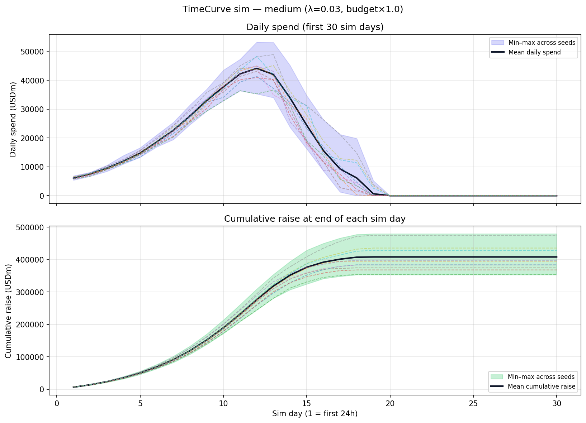

# Yieldomega simulations

Python simulations for **Rabbit Treasury** bounded repricing (DOUB / **Burrow**), **mandatory faction comeback** scoring, and **TimeCurve** participation concentration (Monte Carlo). Contract implementation should match Burrow equations and invariants; TimeCurve sims inform parameter tuning, not consensus.

## Run

From this directory (`simulations/`):

```bash
PYTHONPATH=. python3 -m unittest discover -s tests -v
PYTHONPATH=. python3 -m bounded_formulas
PYTHONPATH=. python3 -m timecurve_sim --seeds 40 --top 8 --out output/timecurve_sweep.json
```

**EcoStrategy audit scenarios (shark vs believer)** — [`audits/audit_ecostrategy_1777969776.md`](../audits/audit_ecostrategy_1777969776.md), [GitLab #161](https://gitlab.com/PlasticDigits/yieldomega/-/issues/161):

```bash
PYTHONPATH=. python3 -m ecostrategy --scenario all --seed 42 --out output/ecostrategy_report.json
PYTHONPATH=. python3 -m ecostrategy --scenario C --population 240 --horizon-sec 28800
```

Package [`ecostrategy/`](ecostrategy/) implements **scenarios A–C** with **`WarBowWorld`** (`warbowSteal` / `warbowRevenge` / `warbowActivateGuard` rules: 2× eligibility, 10%/1% drains, UTC-day caps, 24h revenge windows). JSON/Markdown-friendly CLI prints **`mirrored_from_contract`** vs **`approximations`** (`ecostrategy/constants.py`). Tests: `tests/test_ecostrategy.py`.

Use `python3 -m timecurve_sim --full-grid` for a larger grid (slower). The Monte Carlo sweep uses **canonical timer policy** aligned with deploy docs: **24 h** initial countdown, **96 h** remaining-time cap, **120 s** extension per buy, **20%/day** CHARM-envelope growth (see `timecurve_sim.model.canonical_timecurve_params`). **Timer hard-reset:** when remaining time before a buy is **strictly below 13 minutes**, the next deadline snaps toward **15 minutes** remaining (`extend_deadline_or_reset_below_threshold`, matching `TimeMath.extendDeadlineOrResetBelowThreshold` / `TimeCurve.sol`). **WarBow (simulated):** each qualifying buy accrues **Battle Points** from the same **base / hard-reset / clutch / streak-break / ambush** structure as onchain `buy` (see `warbow_buy_bp_delta` + `process_defended_streak_sim` in `timecurve_sim.model`). Optional **toy PvP steals** (`pvp_steal_prob` in `run_single_sale`) drain 10% BP from a random victim for concentration metrics only—they are **not** a full `warbowSteal` model (no UTC-day cap, 2× rule, or CL8Y burns). Sweep JSON includes **`gini_bp`**, **`hard_reset_frac`**, and related fields alongside spend Gini.

Each TimeCurve run uses a fixed **observation horizon** (default 8h simulated time) so timer extensions cannot make the run unbounded; metrics favor **lower Gini**, **lower top-5% spend share**, and **lower labeled-whale spend share** among 500 agents with mixed budgets.

**Wall-clock sale duration** (timer runs until the sale ends, optional tier compliance JSON):

```bash
PYTHONPATH=. python3 -m timecurve_sim.duration_study
```

**Raise milestones** (time to first cross \$1k … \$1b simulated raised, plus sale-end day distribution):

```bash
PYTHONPATH=. python3 -m timecurve_sim.raise_milestone_report --seeds 48 --dt-sec 240
```

**Raise milestones + 30-day curves** (`raise_milestone_sim`): per-seed time series for sim **days 1–30** (calendar days in simulation time): **daily spend** and **cumulative raise** at end of each day. Aggregates **min / max / mean** across seeds and includes **10 sample runs** (first seeds) for the dashed lines. JSON includes **days to reach** each reserve-asset milestone (axis labels may still say “USDm” historically) and **sale duration** distribution.

Requires **matplotlib** and **numpy** for PNG charts (or pass a `.svg` path for a pure-Python SVG). Example:

```bash
pip install matplotlib numpy
PYTHONPATH=. python3 -m timecurve_sim.raise_milestone_sim \
  --seeds 80 \
  --out-json output/raise_milestone_sim.json \
  --out-chart ../docs/img/timecurve-raise-curves.png \
  --chart-scenario medium
```

Chart (medium scenario: Poisson arrival λ=0.03, budget scale 1×, canonical TimeCurve params):



Optional CSV traces (folder is gitignored by default at repo root):

```bash
PYTHONPATH=. python3 -m bounded_formulas --out output
```

With a virtual environment, `pip install -e .` installs the `burrow-sim` console script.

## Pass/fail criteria

Each epoch must satisfy:

- Finite `R`, `S`, `e`, `C`, `m`; `e > 0`.
- `m ∈ [m_min, m_max]`, `C ∈ [0, c_max]`.
- `|e_{t+1} - e_t| ≤ delta_max_frac * e_t`.

Scenarios **good**, **bad**, **worst**, and **attack** exercise healthy flows, weak activity, bank-run stress, and oscillating whale behavior.

## Coverage clip note

`C = R / (S·e)` is clipped to **`[0, c_max]`** so tiny denominators do not explode the multiplier. The lower bound stays **0** so insolvency is not masked.

## Comeback

`bounded_formulas.comeback.faction_scores` always applies a **bounded** bonus to **trailing** factions (median-based trailing set). Adjust `eta` and `B_comeback` in scenario tests if tuning gameplay.
